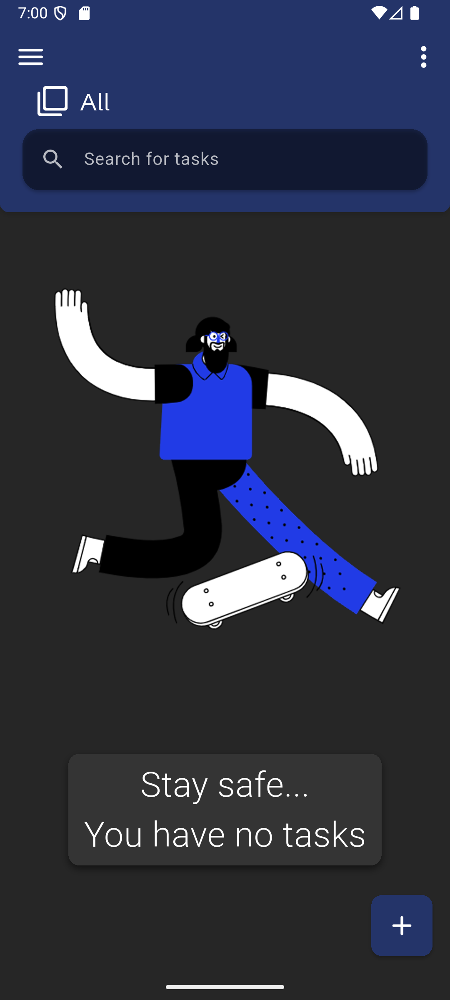
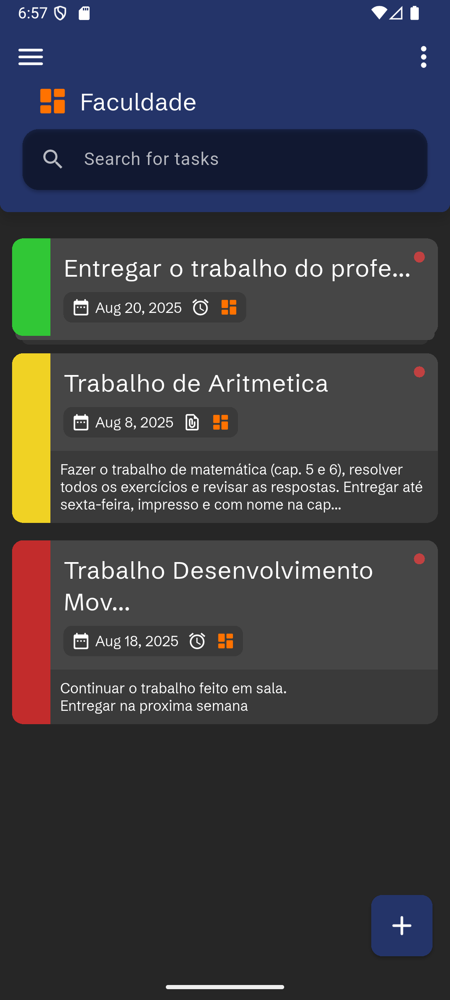
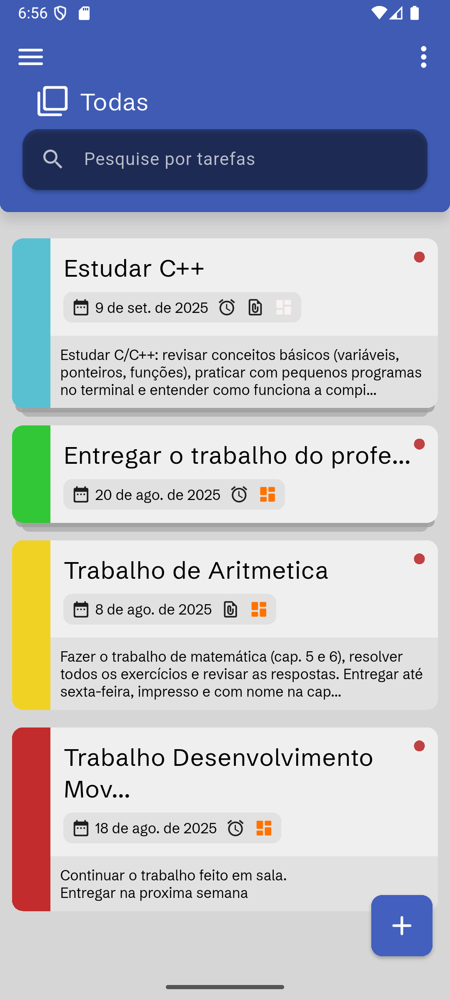
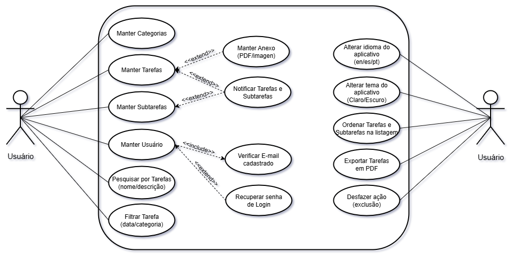
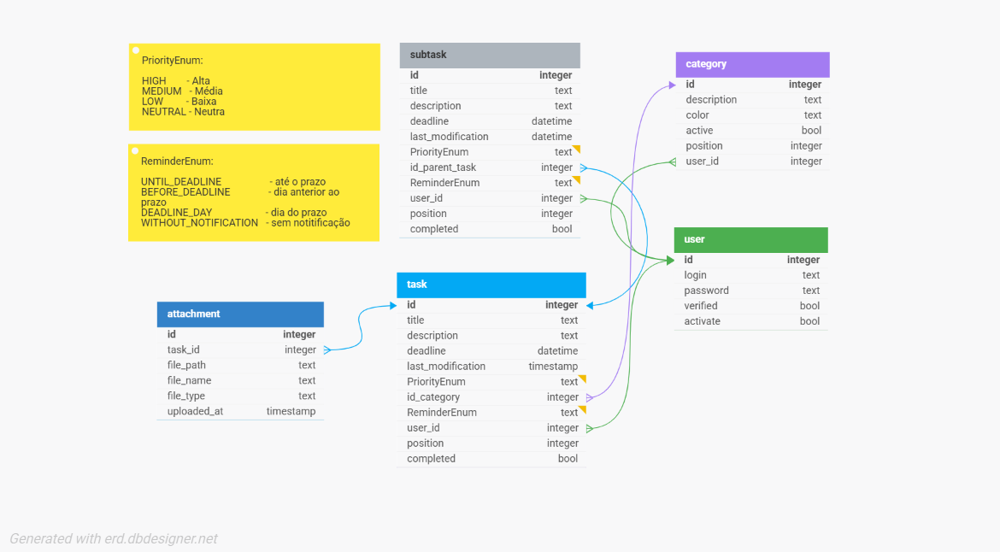

<p align="center">
  
</p>

<h1 align="center">TaskSave: Saving your Appointments</h1>

<p align="center">
  
   
  
</p>

<p align="center">
  
  
  
</p>

---

## Sumário

1. Visão geral
2. Tecnologias Utilizadas
3. Funcionalidades
4. Arquitetura e organização do projeto
5. Especificação da API (endpoints, DTOs)
6. Banco de dados — esquema e recomendações
7. Licença

---

## 1. Visão geral

Este repositório é destinado a armanezar o código fonte do TaskSave, App de agenda pessoal, projeto de trabalho de conclusão de curso do curso de ADS,  **[FEMA](https://www.fema.edu.br/)** 2025

**TaskSave** é um App [Flutter](https://flutter.dev/) de agenda pessoal voltado para o público geral. Sua principal função é servir como uma lista de tarefas avançada com funções como:
- Agendamento de notificações para Tarefas e Subtarefas
- Exportação de Tarefas para formato PDF
- Adição e visualização de anexos (imagens ou PDF) para Tarefas
- Suporte a tematização e internacionalização

---

## 2. Tecnologias Utilizadas

<table>
  <tr>
    <td></td>
    <td><a href="https://flutter.dev/">Flutter</a></td>
  </tr>
  <tr>
    <td></td>
    <td><a href="https://spring.io/">Spring Framework</a></td>
  </tr>
  <tr>
    <td></td>
    <td style="font-size:38px;"><a href="https://www.postgresql.org/">PostgreSQL</a></td>
  </tr>
   <tr>
    <td></td>
    <td style="font-size:38px;"><a href="https://www.docker.com/">Docker</a></td>
  </tr>
   <tr>
    <td></td>
    <td style="font-size:38px;"><a href="https://ubuntu.com/download/server">Ubuntu Server (VPS)</a></td>
  </tr>
</table>

---

## 3. Funcionalidades

* Autenticação de Usuário com verificação de e-mail e recuperação de senha
* CRUD de Tarefas (titulo, descricao, prazo, prioridade, categoria, anexos, tipo_notificacao e Subtarefas)
* CRUD de SubTarefas (titulo, descricao, prazo, prioridade e tipo_notificacao)
* CRUD de categorias (nome e cor)
* Listagem filtrável e ordenável (por prioridade, por data, por categoria)
* Persistência local de anexos com `sqflite` no dispositivo
* Desfazer ação (Excluir Tarefa por exemplo)
* Exportação de Tarefas em formato PDF
* Suporte a internacionalição (tradução)
* Suporte a tematização (claro e escuro)

#### Casos de Uso:
<p align="center">
  
</p>

---

## 4. Arquitetura e organização do projeto

### MVVM
O padrão MVVM (Model–View–ViewModel) foi escolhido para este projeto por oferecer uma separação clara entre interface, lógica de apresentação e dados, algo essencial para manter o código organizado e escalável.

No Flutter, o MVVM se adapta muito bem ao uso de ferramentas como Provider para gerenciamento de estado, permitindo que a ViewModel faça a ponte entre a View e o Model sem que haja acoplamento excessivo.

```
lib/
├─ core/
│  ├─ enums/
│  ├─ errors/
│  ├─ events/
│  ├─ themes/
│  └─ utils/
│
├─ domain/
│  ├─ enums/
│  ├─ models/
│  └─ l10n/
│
├─ presentation/
│  ├─ common/
│  ├─ global_providers/
│  ├─ screens/
│  │  ├─ category_form/
│  │  ├─ home/
│  │  ├─ login/
│  │  ├─ password_change/
│  │  ├─ password_rescue/
│  │  ├─ register/
│  │  ├─ settings/
│  │  ├─ subtask_form/
│  │  ├─ task_details/
│  │  ├─ task_form/
│  │  └─ welcome/
│  └─ wrapper.dart
│
├─ repositories/
│  ├─ api/
│  └─ local/
│
├─ services/
│  ├─ auth/
│  ├─ events/
│  ├─ local_database/
│  └─ notifications/
│
└─ main.dart

```

### Camadas com Influências de DDD

A API foi estruturada utilizando uma arquitetura em camadas, inspirada em princípios do Domain-Driven Design (DDD), a fim de manter o código limpo, modular e de fácil evolução.

Cada camada possui responsabilidades bem definidas:

- Domain → Onde está o núcleo da aplicação, com entidades, regras de negócio e exceções específicas do domínio.
- Application → Contém os services, responsáveis por orquestrar as regras de negócio e coordenar fluxos entre as diferentes partes do sistema.
- Infrastructure → Lida com detalhes técnicos, como persistência de dados, segurança e integrações externas, mantendo o domínio desacoplado da infraestrutura.
- Interfaces → Exposição da aplicação ao mundo externo, englobando controllers e DTOs que transportam dados entre API e cliente.
- Essa separação garante:
- Organização → Estrutura clara e previsível para o crescimento do sistema.
- Flexibilidade → Alterações em infraestrutura ou tecnologia não afetam o domínio.
- Escalabilidade → Facilidade para evoluir e adicionar novas funcionalidades sem comprometer a base existente.

Além disso, a aplicação conta com um diretório de storage, responsável por armazenar arquivos enviados (como anexos).
Essa abordagem traz os benefícios da simplicidade das camadas tradicionais, mas com a robustez dos conceitos de DDD, mantendo o foco no domínio como parte central da aplicação.

```
api/
├─ src/
│  ├─ main/
│  │  ├─ java/
│  │  │  └─ joaopitarelo/
│  │  │     └─ tasksave/
│  │  │        ├─ api/
│  │  │        │  ├─ application/
│  │  │        │  │  └─ services/
│  │  │        │  └─ ApiApplication.java
│  │  │        │
│  │  │        ├─ domain/
│  │  │        │  ├─ attachment/
│  │  │        │  ├─ category/
│  │  │        │  ├─ enums/
│  │  │        │  ├─ exceptions/
│  │  │        │  ├─ subtask/
│  │  │        │  ├─ task/
│  │  │        │  └─ user/
│  │  │        │
│  │  │        ├─ infrastructure/
│  │  │        │  ├─ exceptions/
│  │  │        │  ├─ persistence/
│  │  │        │  └─ security/
│  │  │        │     ├─ validation/
│  │  │        │     ├─ HashUtil.java
│  │  │        │     ├─ SecurityConfig.java
│  │  │        │     └─ SecurityFilter.java
│  │  │        │
│  │  │        └─ interfaces/
│  │  │           ├─ controller/
│  │  │           └─ dtos/
│  │  │              ├─ attachment/
│  │  │              ├─ category/
│  │  │              ├─ subtask/
│  │  │              ├─ task/
│  │  │              └─ user/
│  │  │
│  │  └─ resources/
│  │     └─ application.yml
│  │
│  └─ test/
│     └─ java/... 
│
├─ storage/
│  ├─ user_uploads/           
└─ pom.xml (ou build.gradle)
```

---

## 5. Especificação da API

**Base URL (dev):** `http://localhost:8080/`

### Endpoints principais

* `GET /tasks` — lista todas as tarefas

* `GET /tasks/{id}` — obtém tarefa por id

* `POST /tasks` — cria tarefa (body = TaskDTO)

* `PUT /tasks/{id}` — atualiza tarefa

* `DELETE /tasks/{id}` — remove tarefa
  
* `GET /task/export/pdf` - exportar tarefas em PDF

* `POST /task/2/attachment/upload` - faz o upload de um anexo para uma Tarefa

* `GET /category` — lista categorias
  

### Exemplo de TaskDTO (JSON)

```json
{
    "task": {
        "id": 1,
        "title": "Comprar pão",
        "description": "Ir na padaria do seu joão para comprar pães quentinhos",
        "deadline": "2025-07-28",
        "lastModification": "2025-10-02T20:32:29.948240239",
        "category": {
            "id": 1,
            "description": "Default",
            "color": "#B0BEC5",
            "isDefault": true,
            "ativo": true,
            "position": 0
        },
        "priority": "MEDIUM",
        "completed": false,
        "reminderType": "WITHOUT_NOTIFICATION",
        "attachments": [],
        "subtasks": [],
        "position": 3
    }
}
```

## 6. Banco de dados — esquema

### Tabelas

<p align="center">
  
</p>

---

## 7. Configuração local e comandos úteis

### Pré-requisitos

* Flutter SDK (última versão estável)
* Java 21+
* Maven ou Gradle
* Android SDK/AVD para rodar o app

### Rodando o backend

```bash
# na pasta backend
mvn spring-boot:run
# ou
./mvnw spring-boot:run
```

### Rodando o app Flutter

```bash
# instalar dependências
flutter pub get

# rodar em emulador
flutter run

# gerar APK release
flutter build apk --release
```

---

## 8. Licença

Este projeto está licenciado sob a MIT License, uma das licenças de software mais utilizadas no mundo por sua simplicidade e flexibilidade.
Na prática, isso significa que qualquer pessoa pode:

- Usar o código em projetos pessoais ou comerciais;
- Modificar e adaptar conforme necessário;
- Distribuir cópias, inclusive versões modificadas;
- Sub-licenciar sem restrições.
- A única exigência é manter o aviso de copyright e a licença original em qualquer cópia ou parte significativa do software.

Essa escolha foi feita porque a MIT License promove a liberdade de uso, garantindo que o código do projeto possa ser aproveitado e expandido sem burocracias, ao mesmo tempo em que preserva o reconhecimento do autor original.
